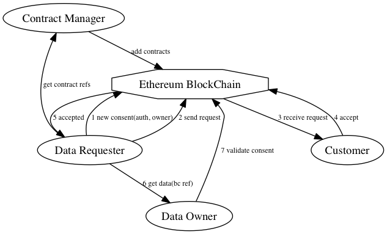

# e-nettet blockchain POC solution description

## Dictionary

### Blockchain [1](https://github.com/ethereum/wiki/wiki/Glossary)

  * User - someone who possesses an account
  * Participant - a user who is involved in a specific consent
  * Private key - a secret key used to prove the identity of a participant.
  * Public key - a public key used to identify a participant or an account. Also called an address
  * Account - a public key containing Ether
  * Address - a public key identifying a participant or a transaction. Example `cd2a3d9f938e13cd947ec05abc7fe734df8dd826`.
  * Transaction - an entity in the Blockchain e.g. a participant accepts a request for consent.
  * Block - a package containing one or more transactions, a reference to the previous block in the Blockchain, a timestamp and a nonce used in the proof-of-work mining puzzle.
  * EVM (Ethereum Virtuel Maskine) code - executable code belonging to an account.
  * Contract - an account not controlled by a user but by EVM code.
  * Ether - Currency i Ethereum blockchain.
  * Gas - Gas is bought by ether and a transaction is only accepted if sufficient gas is paid in the transaction to cover the cost of mining.

## Contracts in Ethereum

Both ordinary users and contracts can create transactions, but a contract only creates transactions as a reaction to other transactions that the contract receives.

A contract is defined by code that resembles a class in object oriented programming and is written in a programming language called Solidity.

```javascript
contract ExampleContract {

    address public owner;

    uint balance;

    function ExampleContract() {
        owner = msg.sender;
    }

    function getBalance() constant returns (uint) {
        return balance;
    }

    modifier onlyOwner {
    	if (msg.sender != owner) throw;
        _
    }

    function addBalance(uint amount) onlyOwner {
        balance += amount;
    }
}
```
Simple read operations are free (do not cost gas). A read operation such as `getBalance()` will not create a transaction because the state of the contract is unchanged.

A write operation such as  `addBalance()` will change the variable  `balance` which is stored in the Blockchain. This operation including the necessary calculations must be paid with gas in order to have the transaction executed. Operations causing mathematical operations, iterations or complicated data structures also cost gas even though they do not write data.

A contract can have more instances. Each function knows which address that executes it by reading the `msg.sender` variable. That way you can perform validation within the function and deny execution if the addresses do not match. The function  `addBalance()` is protected by the `onlyOwner` modifier which stops execution if another address than owner tries to execute it.

As shown above you can define complicated rules regarding who can do what on the contract. The contract has multiple use cases because a contract is not a document but an executable program.

## Roles in the system

  * *Customer* - The person giving consent - usually a customer
  * *Data requestor* - The organization that requires the data in order to deliver a service to the customer. The data requestor initiates the consent process
  * *Data owner* - The organization that owns the data and requires the consent from the customer in order to deliver the data to the data requestor

## User stories
Some user stories are ideas that are not fully clarified and possibly out of scope. These are marked with [].

### Customer

#### As a *customer* I want the *data requestor* to deliver a service that requires data from *Data owner*. I will receive a request for consent from *data requestor* and I will decide whether to accept or reject the request.

  * The request must contain the following information
    * Who is it from (*data requestor*)?
    * Who owns the data (*data owner*)?
    * What is the purpose for the data requestor?
    * Which data must be the data owner obtain access to (*data specification*)*
    * Consent limitations (duration, number of requests, other)

#### As a *customer* I want to be able to accept a request from a  *data requestor*

  * If I haven't actively accepted a request I have not given my consent
  * The *data specification* in my reply must be encrypted so only the *data owner* can read it

#### As a *customer* I want to be able to reject a request from a  *data requestor*

    * If I reject a request for consent the status of the consent changes from requested to rejected
    * The *data specification* in my reply must be encrypted so only the *data requestor* can read it

#### As a *customer* I want to be able to see a list of all my consents so I can get an overview over which consents I have given

  * I must be able to se all consents to my currently active addresses
  * I must be able to see all details on each consent
  * I must be able to see when the consent was requested, accepted or withdrawn

#### As a *customer* I want to be able to withdraw a consent so that the *data requestor* no longer can use it

  * If I withdraw a consent the status of the consent changes from accepted to withdrawn

#### As a *customer* I want to be able use my right to be forgotten in accordance with the EU Data Protection Regulation

  * The relation between *customer* identity and public keys on the blockchain must be removed from whatever system contains it (N.B. The relation is not stored in the Blockchain itself but in an external system at a service provider)
  * If the consent is not withdrawn before the relation is deleted, the consent will still appear active in the blockchain. The identity can however not be confirmed and thus the data owner will not reply requests for data
  * It would be advisable (but not necessary) that the users agree on a best practice of withdrawal before forget
  * The relation will still be stored at the *data owner* in order to comply with the requirement in other legislation

### Data requestor

#### As a *data requestor* I want to be able to request a *customer* for consent

  * Public keys for customer and data owner must be retrieved from external systems
  * Consent is created with reference to a contract (a sort of template for consent)
  * The contract specifies rules regarding duration and terms of the consent.
  * Data specification and consent limitations must be encrypted so only the customer can read it

#### As a *data requestor* I want to be able to know that the consent has been accepted by the *customer* so that I can request data from the data owner

  * I don't need to be able to read the accepted consent as it is encrypted so only the *data owner* can read it
  * I only need information of the status of the consent

#### [As a *data requestor* I want to be able to request data from  *data owner*]

  * This is probably done through other systems
  * Regardless of which system the data is delivered through, the security of these other systems could be improved by encrypting the data with the public key of the *data requestor*

#### [As a *data requestor* I want to be  able to receive data from a *data owner*]

### Data owner

#### As a *data owner* I want to be able to verify that the customer has given consent to let the data requestor retrieve the specified data.

  * I need to be able to verify the following
    * The requested data is accordance with the data specification of the consent
    * There are no limitations hindering the delivery of the data (e.g. duration)
    * The *customer* on the consent is identical to the customer in my own system (this is verified by an external system)
    * The *data requestor* is identical to the user requesting the data requestor (this is verified by an external system and possibly by encrypting the data so only the *data requestor* can read it)  
    * The consent is accepted and not withdrawn

#### as a *data owner* I want to be able to prove that the *customer* has given consent to giving data to a *data requestor*

  * This also applies to withdrawn and consents where the customer has used the right to be forgotten
  * This is done by looking up the status of the consent in the Blockchain and by verifying the identity of the customer each time someone requests data
  * The response from the identity verification service must be stored each time as a proof of consent (the actual consent in the Blockchain is always avaiable)

#### [As a *data owner* I want to be able to receive a request for data from a *data requestor*]

#### [As a *data owner* I want to be able to send data to a *data requestor*]

  * I will encrypt the data so only the *data requestor* can read it
  * This is done through external systems

### Anonymity

#### As a participant I don't want my identity to be revealed to others

  * All participants are only identified by a public key
  * The identities of the participants can be verified if you know the CPR or CVR number and you are one of the other participants on the consent in question
    * The *customer* can verify all other participants
    * The *data requestor* can not verify any of the other participants
    * The *data owner* can verify the customer
    * All verifications are encrypted with the public key of the requestor in order to  avoid brute force verification
  * The data specification is encrypted in all transactions

#### As a data requestor I don't want my identity or the data specification to be revealed to others

    * I am only identified by a public key that differs for each consent
    * My identity can only be verified if you know my CPR or CVR number
    * The data specification is encrypted in all transactions

## Systems architecture

### Anonymity

A basic component in Ethereum is an address. A transaction can be performed between two or more address. In currency transactions, one or more adresses are sender and one or more addresses are receiver. In a smart contract you must know the address of the contract, and the address of all the counterparties. In order  This requirement is conflicting with the requirement of anonymity and thus the decryption and encryption for each step in the consent process.

The address is a pseudonym in the same way as a telephone number. There is no information in the address itself that can identify the owner, but once the identity is known all transactions regarding the address can be linked to a specific identity. To minimize the impact if the identity of an address is revealed, it is advisable that an address is only used on one consent process. This will also enable the customer to use the right to be forgotten on only one consent process.

The *data owner* will be able to link different addresses to the same identity if the *customer* gives consent to multible *data requestors*. This is however acceptable as the *data owner* does not gain access to more information than necessary.

#### Decentralized consent, addresses already known

  * *Data Requestor 1* has the address `111`.
  * *Customer 1* has the address `222`.
  * *Data owner 1* has the  address `333`.
  * *Data requestor 1* (`111`) requests `222` for consent to retrieve data at `333`.
  * *Customer 1* (`222`) accepts consent that `111` can retrieve data at `333`.
  * *Data owner 1* (`333`) receives consent.
  * It is now publicly know that `222` has given consent to `111` to retrieve data from `333`
  * The data specification and the limitations are encrypted in the Blockchain so only  `111`, `222` and `333` can decrypt it
  * The identities can be verified by requesting verification from external systems

#### Consent with central key store  (PGP)
 // Hvad udtrykker denne mere end den ovenfor..?

  * *Bruger 1* har adresser: `A123`, `A456`, `A789`.
  * *Bank 1* kender *Bruger 1* som `A123`. *Bank 1* har adressen `B111`.
  * *Bank 2* kender *Bruger 1* som `A456`. *Bank 2* har adressen `B222`.
  * *Institution A* kender *Bruger 1* som `A789`. *Institution A* har adressen `I333`.
  * *Bank 1* (`B111`) anmoder `A123` om samtykke for at hente data hos `I333`.
  * *Bruger 1* (`A123`) giver samtykke at `B111` henter data hos `I333` og angiver sin adresse `A789` krypteret med `I333` PGP nøgle.
  * *Institution A* (`I333`) modtager samtykke, dekrypterer `A789` og nu kender *Bruger 1* som `A123` og `A789`.
  * *Bank 2* (`B222`) anmoder `A456` om samtykke for at hente data hos `I333`.
  * *Bruger 1* (`A456`) giver samtykke at `B222` henter data hos `I333` og angiver sin adresse `A789` krypteret med `I333` PGP nøgle.
  * *Institution A* (`I333`) modtager samtykke, dekrypterer `A456` og kender nu *Bruger 1* som `A456` og `A789`.
  * *Institution A* (`I333`) kender at `A123`, `A456`, `A789`, den samme bruger.

#### Conclusion

We conclude that it is possible to achieve an acceptable level of anonymity. Only the *data owner* is able to link different addresses to the same customer. If the *customer* has given consent to multible *data requestors* to retrieve the same data, it is however necessary that the *data owner* knows both consents in order deliver data to both *data requestors*. The *data owner* cannot use this information to extract other information from the blockchain regarding which other consents the customer is involved in.

All participants are protected from similar exposures.
  * Knowing a public key of a specific *data requestor* does not help you figure out how many other consents the *data requestor* has initiated
  * Knowing a public key of a specific *customer* does not help you figure out how many other consents the *customer* has received, accepted or withdrawn
  * Knowing a public key of a specific *data owner* does not help you figure out how many other consents the *data owner* has received

In order to achieve this anonymity the system relies on an external service provider creating alias addresses for customers and verifying the identity behind  those addresses. The other participants must expose similar services. The confidentiality of the system relies on the security of the customer service provider.

Among Blockchain developers various solutions are being discussed e.g. the "zero knowledge proof" (used in [Zcash](https://z.cash/)) and "off-blockchain" transactions (such as [Raiden](http://raiden.network/) project). Currently those solutions are not ready for production and no official deadline for production exists. Ethereum are planning to implement zero knowledge proofs but so far no deadline or specifications are available [loose estimates](https://www.cryptocoinsnews.com/ethereum-add-zcash-privacy-says-vitalik-buterin/) .

### Anonymity through noise

In order to minimize the impact of an exposure of the identity of the addresses we suggest that noise is systematically added the Blockchain. False consents will act as noise and will hide the true consents.

False consents can be created in various ways

  1. When creating a consent some false consents are created as well
  2. Create false consents randomly
  3. Both the above mentioned

Anyone watching the blockchain will be able to see that three parties are participating in a consent, but you can only tell whether a consent is true or false if you are a participant.

If the false consent method is implemented the systems must be able to recognize and hide false consents for the users and only display the true consents.

The false consent method hinders pattern recognition and is used in anonymity focused systems such as [Tor projekt](https://www.torproject.org/) and [Vuvuzela](https://people.csail.mit.edu/nickolai/papers/vandenhooff-vuvuzela.pdf) (research fase). Tor nodes relay messages to each other but even though you can see the messages, it is not possible to tell whether the node has generated the messages itself or it has just relayed a message. Vuvuzela goes a step further than that and creates false messages so you cannot make assumptions on the purpose of the communication.  

### Economy in the blockchain

The Blockchain works differently from ordinar databases because transactions have costs and this cost is paid for by spending a Blockchain currency unit, which in the Ethereum Blockchain is called 'Ether'. We suggest that the *data requestor* pays the cost.

  * *Data requestor* pays Ether to a *customer* by requesting for consent
  * *Customer* uses Ether to reply the request (accept or reject)
  * *Data owner* only need to make simple read operations and does not have to pay

TBD How do we make sure that Ether is not left unspent (if the customer does not reply)? How do we make sure the customer always has enough Ether to pay for withdrawal?   

As a consequence the *Data requestor* cannot request for consent if the *Data requestor* does not own sufficient Ether to cover the transaction cost. Ether can be aquired in two ways

  1. Mine it. Miners gather and validate transactions and build new blocks containing new transactions. Miners earn a reward paid in Ether if their block is accepted
  2. Buy it. Demand for Ether creates an incentive for miners to mine and earn Ether.

Demand for Ether will create a marked where anyone can mine and sell it to *Data requestors*

### Samtykke som et dokument

An alternative solution to a smart contract is a static contract or a document. The [Colored Coins](http://coloredcoins.org/)
project specifies how to make digital assets on the public Bitcoin blockchain. A digital asset is a document linked to a Bitcoin transaction e.g. a ticket, a coupon or in this case a consent. Assets can only be created in limited amounts and cannot be duplicated, falsified or modified. They can only be transferred from one account to another. We can express unilateral declarations and transfer any right expressed in that declaration to another account.

In our case the process could be described as below.

  * *Data requestor* creates a request for consent and transfers it to the *Customer* account. *Customer* is now in possession of the request.
  * *Customer* replies the request by creating a consent document and transfer it to the *Data requestor* who is now in possession of the document
  * *Data requestor* transfers the document to a *data owner* who is now in possession of the document
  * *Data owner* transfers data specified in the consent to the *Data requestor*
  * The consent is now considered used or is returned to the *Data requestor*.

Contrary to a smart contract the logic lies in external systems and not in the Blockchain itself.

The advantage of the system is that it becomes more simpel and easyere to understand because digital assets are similar to physical documents. The risk of failure is also reduces as the documents don't contain executable code and thus no programming errors. The disadvantage is that there is nothing in the system that enforces limitations and rights of the previous owners. There is no way the *customer* can withdraw a consent once it has been transferred.

### Components

  * *Contract Manager* is responsible for deploying contracts to the blockchain and communicating the address of the contracts to the *data requestors* and *data owners* e.g. by exposing a service containing the information
  * *Data requestor*
  * *Data owner*
  * *Customer*
  * *Miner* is providing the necessary CPU power etc. to maintain the Blockchain and thus earning Ether


